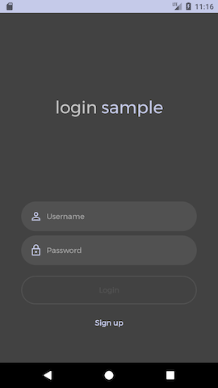

# Login Sample

A simple Android app that allows users to sign up / login / logout.

## What can you learn from this sample

### Android

- Combining **Gradle** and **Docker** to have better control over client-service communication. Take a look at the Gradle [setup](app/build.gradle#L150).
- Using **RxJava** reactive streams to implement objects with complex lifecycles in a clean way. Take a look at the [login screen implementation](app/src/main/kotlin/com/gabrielhuff/sample/login/activity/LoginActivity.kt).
- Writing readable functional tests with **Espresso**. Check out the [test classes](app/src/androidTest/kotlin/com/gabrielhuff/sample/login/test/functional).
- Writing better code with **Kotlin**. See the [source code](app/src/main/kotlin/com/gabrielhuff/sample/login).

### Backend

- Creating reactive server applications with Spring **WebFlux** and **Reactor**. See the [app class](server/src/main/kotlin/com/gabrielhuff/sample/login/server/app.kt).
- Using **Gradle** to automate **Docker** related tasks, such as wrapping the server application in images and pushing these images to remote registries. Take a look at the Gradle [setup](server/build.gradle#L77).
- Writing readable functional tests using Spring's `WebTestClient`. Check out the server [test package](server/src/test/kotlin/com/gabrielhuff/sample/login/server).
- More **Kotlin**. See the [source code](server/src/main/kotlin).

## Understanding the code

The project consists of a Gradle multi-project with 2 projects:

- `app`: The Android client application
- `server`: The server application

### `app` project

Pretty much everything you need to know is in the [activity package](app/src/main/kotlin/com/gabrielhuff/sample/login/activity). All activities have a dependency to a [Client](app/src/main/kotlin/com/gabrielhuff/sample/login/client/Client.kt) object provided by the [application instance](app/src/main/kotlin/com/gabrielhuff/sample/login/App.kt). The client interacts with abstract [data access objects](app/src/main/kotlin/com/gabrielhuff/sample/login/dao), whose implementation can be either mocked in memory (useful for testing) or real. The [utility package](app/src/main/kotlin/com/gabrielhuff/sample/login/util) contains utility to be used by all classes.

The app defines a set of adjustable parameters to be set a build time, available as **flavor dimensions** (check out the Gradle [setup](app/build.gradle#L64)). They are the following:

- Luminance - The overall theme of the app (`light` or `dark`)
- Color - The primary color of the app (`blueGrey`, `cyan`, `green`, `indigo`, `purple` or `teal`)
- Data access - Where the data displayed by the app comes from (`mocked`, `real` or `realLocalServer`)

  - `mocked` variants get all their data from emulated data sources available in memory
  - `real` variants communicate with a server instance running on the cloud at `http://default-environment.hwdbtmcsww.us-east-2.elasticbeanstalk.com/`. They also use the device preferences to store some data locally.
  - `realLocalServer` variants behave like `real` variants, but expect the server instances to be running at the machine that executed the build. In order to start / stop local server instances, run the [`:app:startLocalServer`](app/build.gradle#L201) and [`:app:stopLocalServer`](app/build.gradle#L206) tasks (make sure that **Docker** is up and running first). This is the coolest thing is this project, as these tasks trigger automated pipelines that automatically pull docker images and create / destroy / start / stop docker containers.

For instance, this is how `darkIndigoMocked` variant looks like:

### `server` project

The [app file](server/src/main/kotlin/com.gabrielhuff.sample.login.server/app.kt) defines all the logic, the rest is just utility. The [authentication file](server/src/main/kotlin/com.gabrielhuff.sample.login.server/authentication.kt) defines extensions to handle request authentication. The [data file](server/src/main/kotlin/com.gabrielhuff.sample.login.server/data.kt) defines both data and data access functionality. The [error handling file](server/src/main/kotlin/com.gabrielhuff.sample.login.server/errorHandling.kt) defines utility for handling errors.

The server can run on the host machine by executing the `:server:bootRun` task.